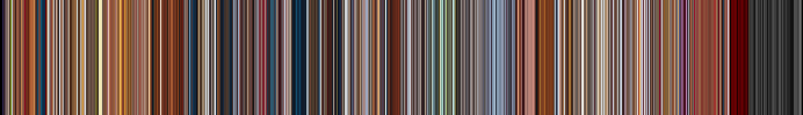
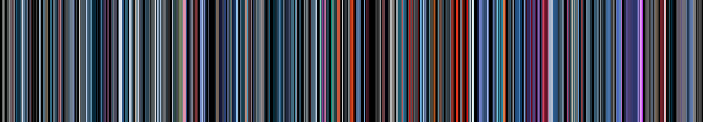

# Movie in Pixels 🌅

**Inspired by Netflix's intro, I decided to make this as a quick <1hr code challenge.**
It's by no means complete. I'm not sure if I'm going refine it further yet :)

Here's an example of Mulan (taking about 5 minutes to process) with the options `--seconds-per-frame 10 --focus 1 --scale 3`:

*There are 692 total bands, one for each 10 seconds of the movie. We've taken the second most dominant colours from these frames.*

Another example using the incredible video [LIFE BEYOND II: The Museum of Alien Life (4K)](https://www.youtube.com/watch?v=ThDYazipjSI), using the same settings but with `--seconds-per-frame 4`:

